# Enler — System Architecture

> **Version:** 1.0  
> **Last Updated:** 2026-06-03  
> **Status:** Phase 0 — Foundation

---

## Table of Contents

1. [High-Level Architecture](#high-level-architecture)
2. [Component Overview](#component-overview)
3. [Data Flow Diagrams](#data-flow-diagrams)
4. [Feature-First Architecture](#feature-first-architecture)
5. [Dependency Graph](#dependency-graph)
6. [State Management Strategy](#state-management-strategy)
7. [Authentication Flow](#authentication-flow)
8. [Realtime Updates](#realtime-updates)
9. [Deep Linking Strategy](#deep-linking-strategy)
10. [Error Handling Strategy](#error-handling-strategy)
11. [Caching Strategy](#caching-strategy)
12. [Security Considerations](#security-considerations)

---

## High-Level Architecture

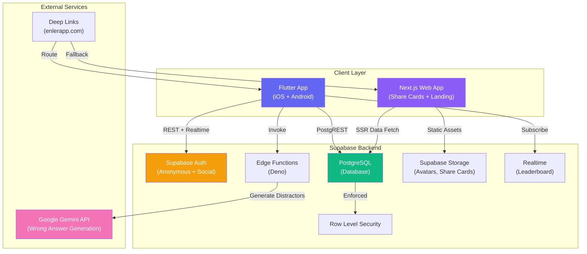

### Architecture Principles

| Principle | Description |
|---|---|
| **Offline-tolerant** | App works with cached data; syncs when online |
| **Edge-first** | Heavy logic (AI calls) runs in Edge Functions, not client |
| **RLS-mandatory** | Every table has Row Level Security — no exceptions |
| **Feature-first** | Code is organized by feature, not by layer |
| **Minimal client secrets** | API keys stay server-side via Edge Functions |

---

## Component Overview

### 1. Flutter App (Mobile — Primary Client)

The Flutter app is the primary user interface. It runs on iOS and Android.

| Responsibility | Details |
|---|---|
| Profile creation | Users pick emoji avatar, set username, answer questions about favorites |
| Quiz experience | Friends solve quizzes via shared links; real-time scoring |
| Results & badges | Animated result screens with badge (rozet) reveals |
| Share cards | Generate gradient share cards for social media |
| Leaderboard | Realtime leaderboard per profile |

**Key packages:**

| Package | Purpose |
|---|---|
| `flutter_riverpod` | State management |
| `supabase_flutter` | Auth, DB, Realtime, Storage |
| `go_router` | Navigation + deep linking |
| `flutter_localizations` | i18n (Turkish v1) |
| `share_plus` | Native share sheet |
| `lottie` | Animations |
| `cached_network_image` | Image caching |
| `flutter_animate` | Micro-animations |

### 2. Next.js Web App (Share Cards + Landing)

The Next.js app handles two responsibilities:

| Responsibility | Details |
|---|---|
| **Landing page** | enlerapp.com — app store links, product info |
| **Share card renderer** | `/quiz/:username` — SSR Open Graph cards for social sharing |
| **Quiz web fallback** | Users without the app can take quizzes on the web |

**Key tech:**

| Technology | Purpose |
|---|---|
| Next.js 14+ (App Router) | SSR + SSG |
| Tailwind CSS | Styling |
| `@supabase/ssr` | Server-side Supabase client |
| `@vercel/og` | Dynamic OG image generation |

### 3. Supabase Backend

| Service | Usage |
|---|---|
| **Auth** | Anonymous sign-in (quiz takers), optional social login (profile owners) |
| **Database** | PostgreSQL with PostgREST API |
| **Row Level Security** | All access policies enforced at DB level |
| **Edge Functions** | Gemini API proxy for generating wrong answers |
| **Realtime** | Leaderboard broadcasts via Postgres Changes |
| **Storage** | Avatar images, generated share cards |

### 4. Google Gemini API

Used exclusively through Edge Functions to generate plausible wrong answers (distractors) for quiz questions. The user provides the correct answer; Gemini generates 3 contextually relevant wrong options.

---

## Data Flow Diagrams

### Flow 1: Profile Creation

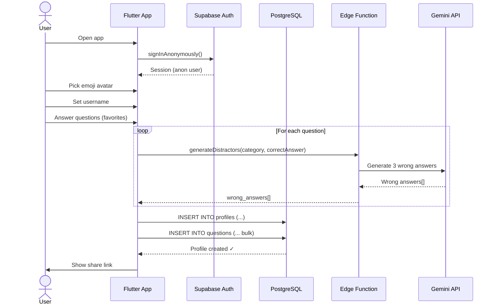

### Flow 2: Quiz Solving

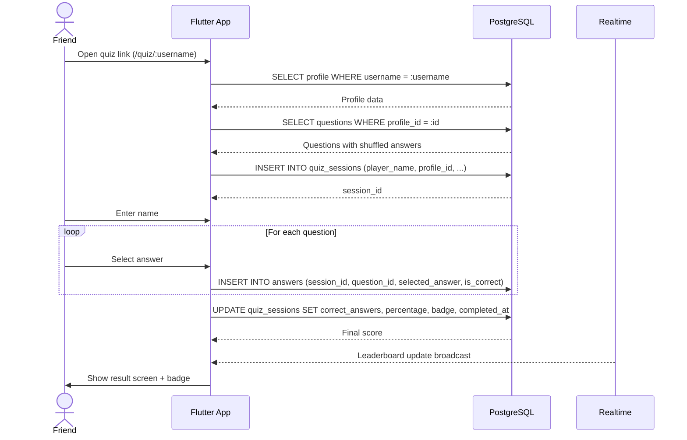

### Flow 3: Scoring & Badge Assignment

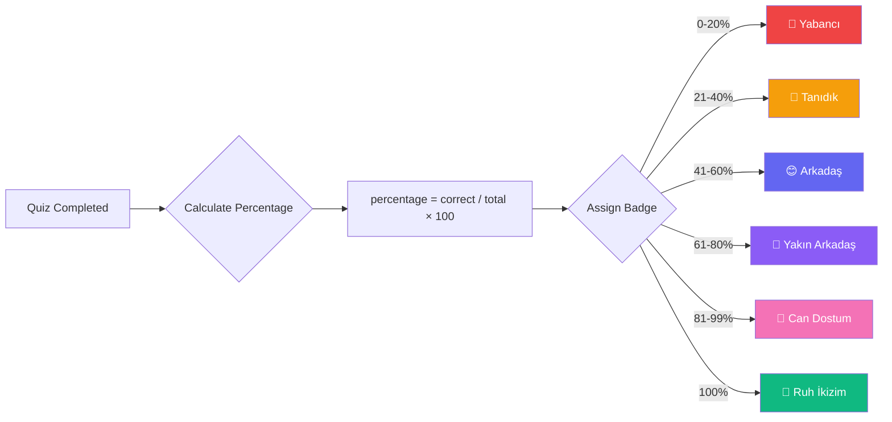

---

## Feature-First Architecture

The Flutter app uses **feature-first** organization. Each feature is a self-contained module with its own layers.

```
lib/
├── app/                          # App-level config
│   ├── app.dart                  # MaterialApp.router
│   ├── router.dart               # GoRouter config
│   └── theme.dart                # ThemeData (Soft Aurora)
│
├── core/                         # Shared infrastructure
│   ├── constants/                # App-wide constants
│   ├── exceptions/               # Custom exception classes
│   ├── extensions/               # Dart extension methods
│   ├── network/                  # Supabase client wrapper
│   ├── utils/                    # Helpers, formatters
│   └── widgets/                  # Reusable UI components
│
├── features/
│   ├── auth/
│   │   ├── data/                 # Repositories, DTOs
│   │   ├── domain/               # Models, interfaces
│   │   └── presentation/         # Screens, widgets, providers
│   │
│   ├── profile/
│   │   ├── data/
│   │   ├── domain/
│   │   └── presentation/
│   │
│   ├── quiz/
│   │   ├── data/
│   │   ├── domain/
│   │   └── presentation/
│   │
│   ├── results/
│   │   ├── data/
│   │   ├── domain/
│   │   └── presentation/
│   │
│   ├── leaderboard/
│   │   ├── data/
│   │   ├── domain/
│   │   └── presentation/
│   │
│   └── share/
│       ├── data/
│       ├── domain/
│       └── presentation/
│
├── l10n/                         # Localization
│   ├── app_tr.arb                # Turkish strings
│   └── l10n.yaml                 # Config
│
└── main.dart                     # Entry point
```

### Layer Responsibilities

| Layer | Contents | Rules |
|---|---|---|
| **data/** | Repository implementations, Supabase queries, DTOs | Only layer that touches Supabase SDK |
| **domain/** | Models (freezed), repository interfaces, enums | Pure Dart — no Flutter or package imports |
| **presentation/** | Screens, widgets, Riverpod providers/notifiers | Only references domain models, never data layer directly |

### Feature Dependencies

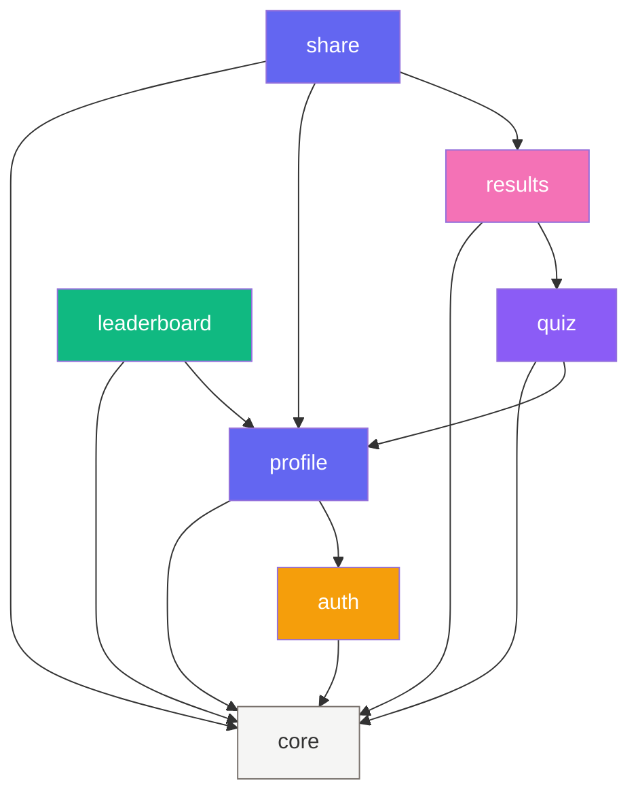

### Import Rules

1. **Features NEVER import from each other's `data/` layer** — only `domain/` models
2. **`core/` never imports from `features/`**
3. **`domain/` never imports from `data/` or `presentation/`**
4. **`presentation/` accesses `data/` only through Riverpod providers**

---

## Dependency Graph

### Flutter Packages

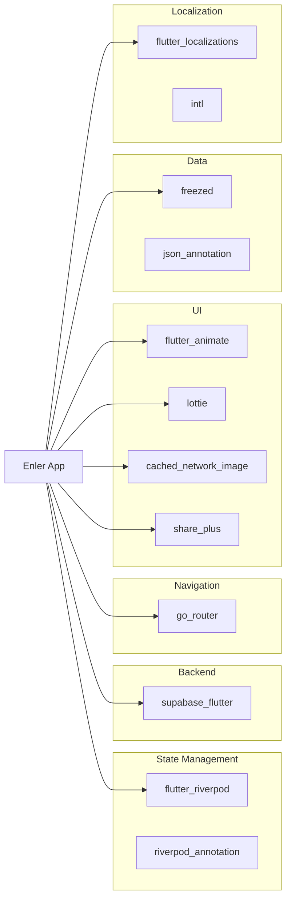

---

## State Management Strategy

Enler uses **Riverpod** (v2 with code generation) for all state management.

### Provider Types Used

| Provider Type | Use Case | Example |
|---|---|---|
| `Provider` | Static dependencies (Supabase client) | `supabaseClientProvider` |
| `FutureProvider` | One-shot async data | `profileProvider(username)` |
| `StreamProvider` | Realtime streams | `leaderboardProvider(profileId)` |
| `NotifierProvider` | Complex mutable state | `quizSessionNotifier` |
| `AsyncNotifierProvider` | Async mutable state | `profileCreationNotifier` |

### State Architecture

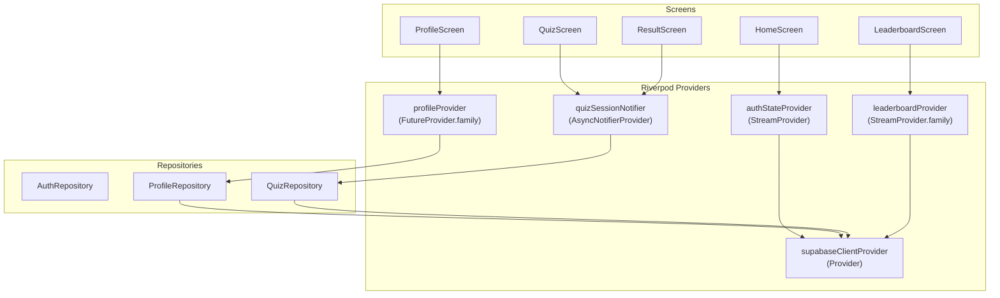

### State Flow Rules

1. **Unidirectional data flow**: UI → Provider → Repository → Supabase → Provider → UI
2. **No direct Supabase calls from widgets** — always go through a provider
3. **Providers are the single source of truth** — no widget-local state for server data
4. **Use `ref.invalidate()` for cache busting** after mutations
5. **Use `AsyncValue` pattern** — always handle loading, error, and data states

---

## Authentication Flow

Enler supports two authentication modes:

| Mode | Who | Purpose |
|---|---|---|
| **Anonymous** | Quiz takers (friends) | Play quizzes without creating an account |
| **Social Login** | Profile owners | Persist their profile across devices (optional upgrade) |

### Auth Flow Diagram

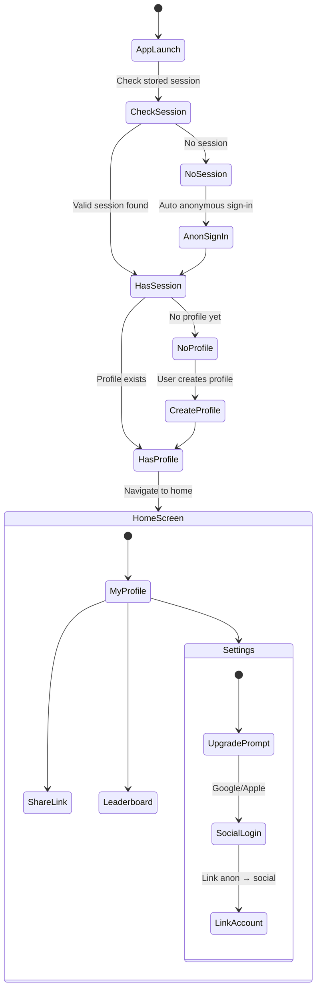

### Auth Rules

1. **Every user starts as anonymous** — zero friction to start
2. **Anonymous users CAN create profiles and take quizzes**
3. **Social login is optional** — only needed for cross-device sync
4. **Anonymous → Social upgrade** preserves all data via `linkIdentity()`
5. **Session tokens** are stored securely via `flutter_secure_storage`
6. **RLS policies** use `auth.uid()` to scope all data access

---

## Realtime Updates

### Leaderboard Realtime

The leaderboard uses Supabase Realtime (Postgres Changes) to show live updates when someone completes a quiz.

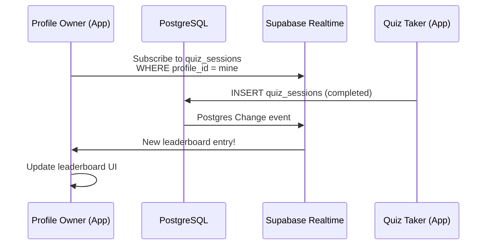

### Realtime Configuration

```dart
// Subscribe to leaderboard updates
supabase
  .channel('leaderboard:$profileId')
  .onPostgresChanges(
    event: PostgresChangeEvent.insert,
    schema: 'public',
    table: 'quiz_sessions',
    filter: PostgresChangeFilter(
      type: PostgresChangeFilterType.eq,
      column: 'profile_id',
      value: profileId,
    ),
    callback: (payload) {
      // Refresh leaderboard
      ref.invalidate(leaderboardProvider(profileId));
    },
  )
  .subscribe();
```

### Realtime Rules

1. **Only subscribe when the leaderboard screen is active** — unsubscribe on dispose
2. **Debounce rapid updates** — batch multiple arrivals within 500ms
3. **Fallback to polling** if Realtime connection drops (30-second interval)

---

## Deep Linking Strategy

### Link Format

| Link | Purpose | Handler |
|---|---|---|
| `https://enlerapp.com/quiz/:username` | Open someone's quiz | Flutter: `QuizScreen` / Web: fallback |
| `https://enlerapp.com/result/:sessionId` | View quiz result | Flutter: `ResultScreen` / Web: OG card |
| `https://enlerapp.com/app` | App store redirect | Web: store links |

### Deep Link Flow

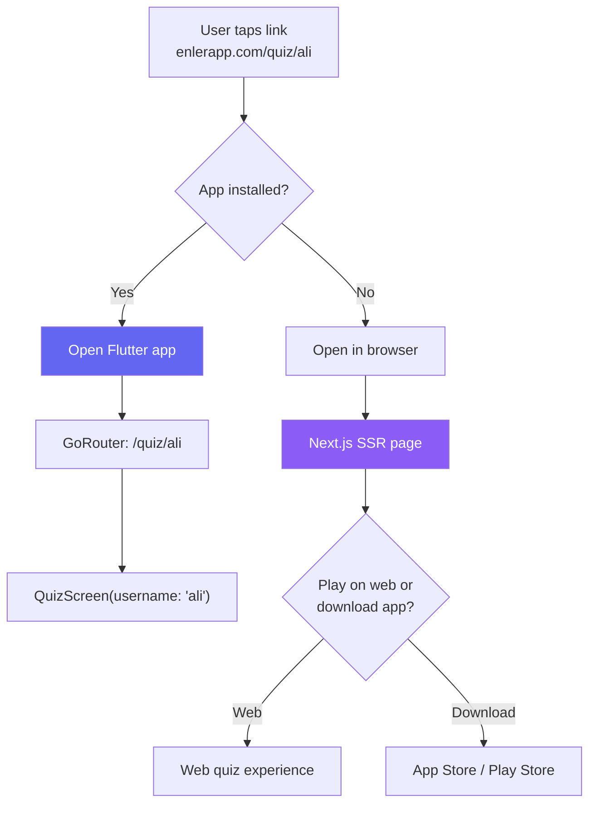

### GoRouter Configuration

```dart
GoRouter(
  routes: [
    GoRoute(
      path: '/',
      builder: (_, __) => const HomeScreen(),
    ),
    GoRoute(
      path: '/quiz/:username',
      builder: (_, state) => QuizScreen(
        username: state.pathParameters['username']!,
      ),
    ),
    GoRoute(
      path: '/result/:sessionId',
      builder: (_, state) => ResultScreen(
        sessionId: state.pathParameters['sessionId']!,
      ),
    ),
    GoRoute(
      path: '/profile/create',
      builder: (_, __) => const ProfileCreationScreen(),
    ),
    GoRoute(
      path: '/leaderboard/:profileId',
      builder: (_, state) => LeaderboardScreen(
        profileId: state.pathParameters['profileId']!,
      ),
    ),
  ],
);
```

### Platform Configuration

| Platform | Method |
|---|---|
| **Android** | App Links — `assetlinks.json` hosted on enlerapp.com |
| **iOS** | Universal Links — `apple-app-site-association` on enlerapp.com |
| **Web** | Next.js routing (built-in) |

---

## Error Handling Strategy

### Error Classification

| Level | Type | Example | Handling |
|---|---|---|---|
| **Network** | Connectivity | No internet | Retry with backoff, show offline indicator |
| **Auth** | Session | Token expired | Auto-refresh, re-auth if needed |
| **Validation** | Input | Username taken | Inline field error, user-facing message |
| **Server** | Supabase | RLS denied | Log, show generic error |
| **AI** | Gemini | Rate limited | Fallback to manual wrong answer entry |
| **Unknown** | Unexpected | Unhandled exception | Log to crash reporting, show generic error |

### Error Handling Architecture

```dart
// Base exception hierarchy
sealed class AppException implements Exception {
  final String message;
  final String? code;
  const AppException(this.message, {this.code});
}

class NetworkException extends AppException { ... }
class AuthException extends AppException { ... }
class ValidationException extends AppException { ... }
class ServerException extends AppException { ... }
class AIGenerationException extends AppException { ... }
```

### Error Flow

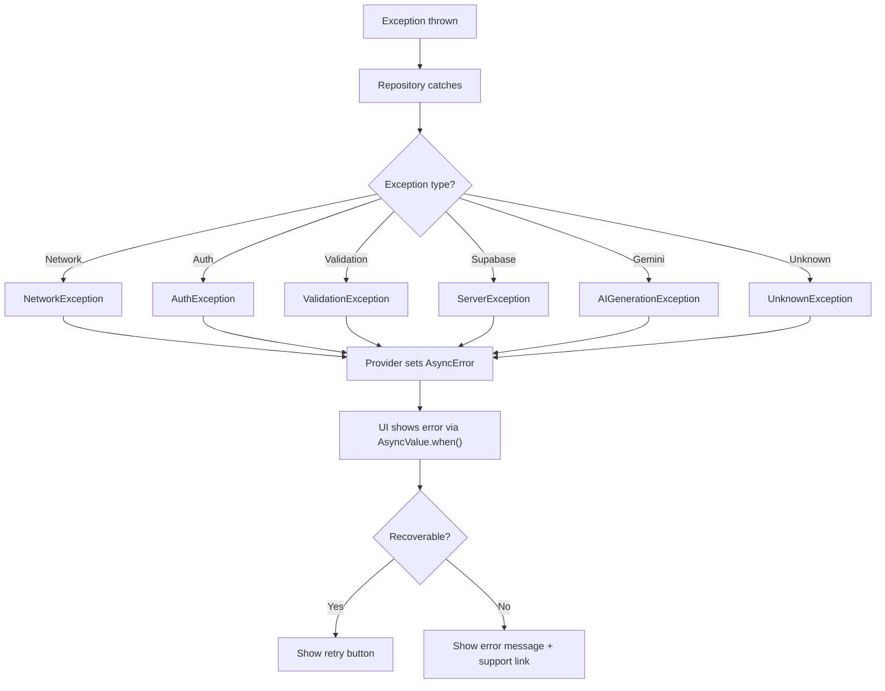

### Error Reporting

- **Dev:** Errors logged to console with full stack traces
- **Staging:** Errors sent to a monitoring service (e.g., Sentry)
- **Prod:** Crashes reported, PII stripped, user sees localized error message

---

## Caching Strategy

### Cache Layers

| Layer | What | TTL | Invalidation |
|---|---|---|---|
| **Memory** (Riverpod) | Provider state | Session lifetime | `ref.invalidate()` after mutations |
| **HTTP** (Supabase) | REST responses | Supabase defaults | Automatic via PostgREST |
| **Image** (cached_network_image) | Avatar images | 7 days | Clear on profile update |
| **Local** (SharedPreferences) | User preferences, last session | Permanent | Manual clear |

### Caching Rules

1. **Profile data** is cached in memory — invalidated when the user edits their profile
2. **Quiz questions** are fetched fresh each time a quiz is started (to get latest edits)
3. **Leaderboard** is realtime — no caching, always live
4. **Share card images** are cached in Storage — regenerated only if profile changes
5. **Gemini responses** (wrong answers) are stored in `questions.wrong_answers` — never re-fetched

### Cache Invalidation Flow

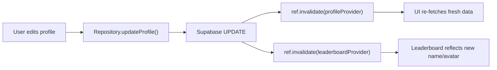

---

## Security Considerations

### Client-Side Security

| Concern | Mitigation |
|---|---|
| API keys exposed | Supabase anon key is safe with RLS; Gemini key is only in Edge Functions |
| Token storage | `flutter_secure_storage` (Keychain/Keystore) |
| Deep link spoofing | Validate all path parameters before use |
| Input injection | Parameterized queries via PostgREST (automatic) |

### Server-Side Security

| Concern | Mitigation |
|---|---|
| Unauthorized data access | RLS on every table — no exceptions |
| Mass data scraping | Rate limiting via Supabase (built-in) |
| AI prompt injection | Sanitize user input before sending to Gemini |
| Malicious usernames | CHECK constraint: `^[a-z0-9_.]{3,20}$` |

### Data Privacy

- **Minimal data collection**: Only username, display name, emoji avatar, quiz answers
- **No email required** for anonymous users
- **Quiz takers** can play with just a name (no account needed)
- **KVKK compliance** (Turkish data protection) considered for v1
- **Data deletion**: Users can delete their profile and all associated data

---

## Infrastructure

### Environments

| Environment | Supabase Project | Next.js | Purpose |
|---|---|---|---|
| **Local** | Supabase CLI (Docker) | `next dev` | Development |
| **Staging** | Separate Supabase project | Vercel Preview | Testing |
| **Production** | Production Supabase project | Vercel Production | Live |

### CI/CD Pipeline

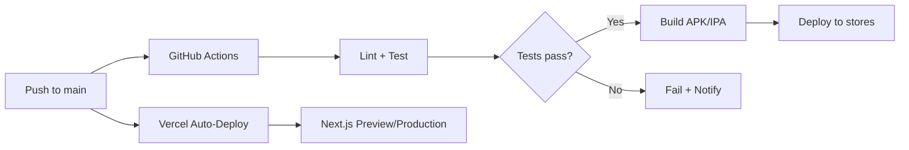

### Monitoring

| What | Tool |
|---|---|
| Crash reporting | Sentry / Firebase Crashlytics |
| Analytics | Supabase Analytics + custom events |
| Performance | Flutter DevTools, Vercel Analytics |
| Database | Supabase Dashboard (query performance) |
| Uptime | Supabase built-in monitoring |
