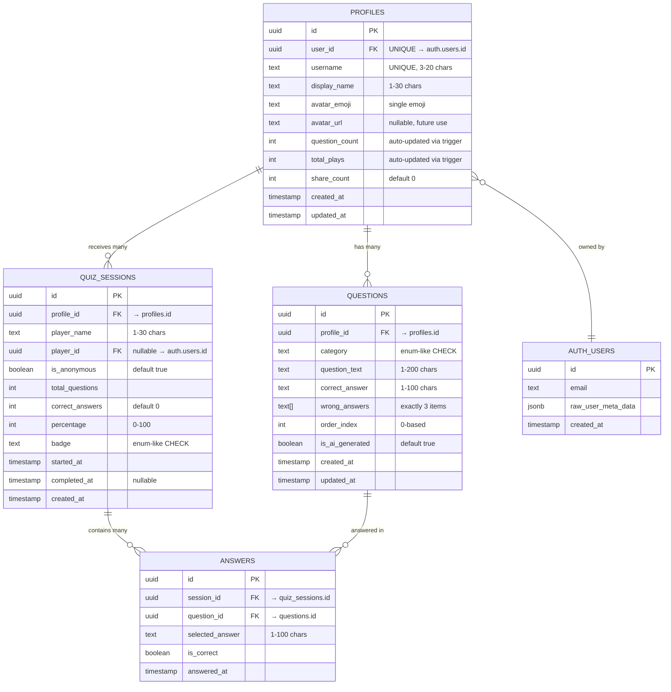
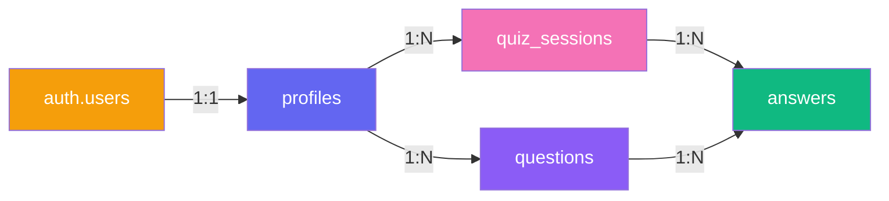

# Enler — Database Schema

> **Version:** 1.0  
> **Last Updated:** 2026-06-03  
> **Status:** Phase 0 — Foundation  
> **Engine:** PostgreSQL 15 (Supabase)

---

## Table of Contents

1. [ER Diagram](#er-diagram)
2. [Schema Overview](#schema-overview)
3. [Table Definitions](#table-definitions)
4. [Indexes](#indexes)
5. [CHECK Constraints](#check-constraints)
6. [Triggers & Functions](#triggers--functions)
7. [Row Level Security (RLS) Policies](#row-level-security-rls-policies)
8. [Enums](#enums)
9. [Seed Data Examples](#seed-data-examples)
10. [Migration Conventions](#migration-conventions)
11. [Performance Notes](#performance-notes)
12. [Future Considerations](#future-considerations)

---

## ER Diagram



---

## Schema Overview

| Table | Purpose | Approximate Row Count (Year 1) |
|---|---|---|
| `profiles` | User profiles with avatar and stats | ~10K |
| `questions` | Quiz questions created by profile owners | ~100K (10 per profile) |
| `quiz_sessions` | Each quiz attempt by a friend | ~500K |
| `answers` | Individual answers within a session | ~5M (10 per session) |

### Key Relationships



---

## Table Definitions

### 1. `profiles`

Stores user profile data. One profile per authenticated user.

```sql
CREATE TABLE public.profiles (
    id          uuid        PRIMARY KEY DEFAULT gen_random_uuid(),
    user_id     uuid        NOT NULL UNIQUE REFERENCES auth.users(id) ON DELETE CASCADE,
    username    text        NOT NULL UNIQUE,
    display_name text       NOT NULL,
    avatar_emoji text       NOT NULL DEFAULT '😊',
    avatar_url  text,
    question_count integer  NOT NULL DEFAULT 0,
    total_plays integer     NOT NULL DEFAULT 0,
    share_count integer     NOT NULL DEFAULT 0,
    created_at  timestamptz NOT NULL DEFAULT now(),
    updated_at  timestamptz NOT NULL DEFAULT now()
);

-- Enable RLS
ALTER TABLE public.profiles ENABLE ROW LEVEL SECURITY;
```

#### Column Details

| Column | Type | Nullable | Default | Description |
|---|---|---|---|---|
| `id` | `uuid` | NO | `gen_random_uuid()` | Primary key |
| `user_id` | `uuid` | NO | — | References `auth.users.id`, unique |
| `username` | `text` | NO | — | URL-safe username, unique, 3–20 chars |
| `display_name` | `text` | NO | — | Display name shown in UI, 1–30 chars |
| `avatar_emoji` | `text` | NO | `'😊'` | Single emoji character |
| `avatar_url` | `text` | YES | `NULL` | Future: custom avatar image URL |
| `question_count` | `integer` | NO | `0` | Auto-updated via trigger |
| `total_plays` | `integer` | NO | `0` | Auto-updated via trigger |
| `share_count` | `integer` | NO | `0` | Incremented by client on share |
| `created_at` | `timestamptz` | NO | `now()` | Row creation time |
| `updated_at` | `timestamptz` | NO | `now()` | Last modification time |

---

### 2. `questions`

Stores quiz questions created by profile owners. Each profile has up to 10 questions.

```sql
CREATE TABLE public.questions (
    id              uuid        PRIMARY KEY DEFAULT gen_random_uuid(),
    profile_id      uuid        NOT NULL REFERENCES public.profiles(id) ON DELETE CASCADE,
    category        text        NOT NULL,
    question_text   text        NOT NULL,
    correct_answer  text        NOT NULL,
    wrong_answers   text[]      NOT NULL,
    order_index     integer     NOT NULL DEFAULT 0,
    is_ai_generated boolean     NOT NULL DEFAULT true,
    created_at      timestamptz NOT NULL DEFAULT now(),
    updated_at      timestamptz NOT NULL DEFAULT now()
);

-- Enable RLS
ALTER TABLE public.questions ENABLE ROW LEVEL SECURITY;
```

#### Column Details

| Column | Type | Nullable | Default | Description |
|---|---|---|---|---|
| `id` | `uuid` | NO | `gen_random_uuid()` | Primary key |
| `profile_id` | `uuid` | NO | — | References `profiles.id` |
| `category` | `text` | NO | — | Question category (see enums) |
| `question_text` | `text` | NO | — | The question shown to quiz takers |
| `correct_answer` | `text` | NO | — | The correct answer |
| `wrong_answers` | `text[]` | NO | — | Array of exactly 3 wrong answers |
| `order_index` | `integer` | NO | `0` | Display order (0-based) |
| `is_ai_generated` | `boolean` | NO | `true` | Whether wrong answers were AI-generated |
| `created_at` | `timestamptz` | NO | `now()` | Row creation time |
| `updated_at` | `timestamptz` | NO | `now()` | Last modification time |

---

### 3. `quiz_sessions`

Tracks each quiz attempt by a friend. Created when a friend starts a quiz.

```sql
CREATE TABLE public.quiz_sessions (
    id              uuid        PRIMARY KEY DEFAULT gen_random_uuid(),
    profile_id      uuid        NOT NULL REFERENCES public.profiles(id) ON DELETE CASCADE,
    player_name     text        NOT NULL,
    player_id       uuid        REFERENCES auth.users(id) ON DELETE SET NULL,
    is_anonymous    boolean     NOT NULL DEFAULT true,
    total_questions integer     NOT NULL,
    correct_answers integer     NOT NULL DEFAULT 0,
    percentage      integer     NOT NULL DEFAULT 0,
    badge           text,
    started_at      timestamptz NOT NULL DEFAULT now(),
    completed_at    timestamptz,
    created_at      timestamptz NOT NULL DEFAULT now()
);

-- Enable RLS
ALTER TABLE public.quiz_sessions ENABLE ROW LEVEL SECURITY;
```

#### Column Details

| Column | Type | Nullable | Default | Description |
|---|---|---|---|---|
| `id` | `uuid` | NO | `gen_random_uuid()` | Primary key |
| `profile_id` | `uuid` | NO | — | The profile being quizzed about |
| `player_name` | `text` | NO | — | Name entered by quiz taker |
| `player_id` | `uuid` | YES | `NULL` | If quiz taker is logged in |
| `is_anonymous` | `boolean` | NO | `true` | Whether the player was anonymous |
| `total_questions` | `integer` | NO | — | Number of questions in this quiz |
| `correct_answers` | `integer` | NO | `0` | Number of correct answers |
| `percentage` | `integer` | NO | `0` | Score as 0–100 integer |
| `badge` | `text` | YES | `NULL` | Badge key assigned on completion |
| `started_at` | `timestamptz` | NO | `now()` | When the quiz was started |
| `completed_at` | `timestamptz` | YES | `NULL` | When the quiz was finished |
| `created_at` | `timestamptz` | NO | `now()` | Row creation time |

---

### 4. `answers`

Stores individual answers for each question in a quiz session.

```sql
CREATE TABLE public.answers (
    id              uuid        PRIMARY KEY DEFAULT gen_random_uuid(),
    session_id      uuid        NOT NULL REFERENCES public.quiz_sessions(id) ON DELETE CASCADE,
    question_id     uuid        NOT NULL REFERENCES public.questions(id) ON DELETE CASCADE,
    selected_answer text        NOT NULL,
    is_correct      boolean     NOT NULL,
    answered_at     timestamptz NOT NULL DEFAULT now()
);

-- Enable RLS
ALTER TABLE public.answers ENABLE ROW LEVEL SECURITY;
```

#### Column Details

| Column | Type | Nullable | Default | Description |
|---|---|---|---|---|
| `id` | `uuid` | NO | `gen_random_uuid()` | Primary key |
| `session_id` | `uuid` | NO | — | References `quiz_sessions.id` |
| `question_id` | `uuid` | NO | — | References `questions.id` |
| `selected_answer` | `text` | NO | — | The answer the player chose |
| `is_correct` | `boolean` | NO | — | Whether the answer was correct |
| `answered_at` | `timestamptz` | NO | `now()` | When the answer was submitted |

---

## Indexes

### profiles

```sql
-- Username lookup (quiz link resolution)
-- Already covered by UNIQUE constraint, but explicit for clarity
CREATE UNIQUE INDEX idx_profiles_username ON public.profiles (username);

-- User ID lookup (auth → profile)
-- Already covered by UNIQUE constraint
CREATE UNIQUE INDEX idx_profiles_user_id ON public.profiles (user_id);
```

### questions

```sql
-- Fetch questions for a profile, ordered
CREATE INDEX idx_questions_profile_id_order 
    ON public.questions (profile_id, order_index);
```

### quiz_sessions

```sql
-- Leaderboard: sessions for a profile, ordered by percentage descending
CREATE INDEX idx_quiz_sessions_profile_leaderboard 
    ON public.quiz_sessions (profile_id, percentage DESC, completed_at DESC)
    WHERE completed_at IS NOT NULL;

-- Player lookup: sessions by a specific player
CREATE INDEX idx_quiz_sessions_player_id 
    ON public.quiz_sessions (player_id)
    WHERE player_id IS NOT NULL;

-- Profile stats: count completed sessions
CREATE INDEX idx_quiz_sessions_profile_completed 
    ON public.quiz_sessions (profile_id)
    WHERE completed_at IS NOT NULL;
```

### answers

```sql
-- Fetch all answers in a session
CREATE INDEX idx_answers_session_id 
    ON public.answers (session_id);

-- Question analytics: how many got this question right
CREATE INDEX idx_answers_question_correct 
    ON public.answers (question_id, is_correct);
```

---

## CHECK Constraints

### profiles

```sql
-- Username: lowercase alphanumeric, underscores, dots; 3-20 chars
ALTER TABLE public.profiles
    ADD CONSTRAINT chk_profiles_username 
    CHECK (username ~ '^[a-z0-9_.]{3,20}$');

-- Display name: 1-30 chars, trimmed
ALTER TABLE public.profiles
    ADD CONSTRAINT chk_profiles_display_name 
    CHECK (char_length(trim(display_name)) BETWEEN 1 AND 30);

-- Avatar emoji: 1-10 chars (emoji can be multi-byte)
ALTER TABLE public.profiles
    ADD CONSTRAINT chk_profiles_avatar_emoji 
    CHECK (char_length(avatar_emoji) BETWEEN 1 AND 10);

-- Counts: non-negative
ALTER TABLE public.profiles
    ADD CONSTRAINT chk_profiles_question_count_positive 
    CHECK (question_count >= 0);

ALTER TABLE public.profiles
    ADD CONSTRAINT chk_profiles_total_plays_positive 
    CHECK (total_plays >= 0);

ALTER TABLE public.profiles
    ADD CONSTRAINT chk_profiles_share_count_positive 
    CHECK (share_count >= 0);
```

### questions

```sql
-- Category must be one of the allowed values
ALTER TABLE public.questions
    ADD CONSTRAINT chk_questions_category 
    CHECK (category IN (
        'favorite_color',
        'favorite_food', 
        'favorite_movie',
        'favorite_music',
        'favorite_hobby',
        'favorite_place',
        'favorite_book',
        'favorite_animal',
        'favorite_sport',
        'favorite_season',
        'personality',
        'dream',
        'memory',
        'preference',
        'custom'
    ));

-- Question text: 1-200 chars
ALTER TABLE public.questions
    ADD CONSTRAINT chk_questions_question_text 
    CHECK (char_length(trim(question_text)) BETWEEN 1 AND 200);

-- Correct answer: 1-100 chars
ALTER TABLE public.questions
    ADD CONSTRAINT chk_questions_correct_answer 
    CHECK (char_length(trim(correct_answer)) BETWEEN 1 AND 100);

-- Wrong answers: exactly 3 items
ALTER TABLE public.questions
    ADD CONSTRAINT chk_questions_wrong_answers_count 
    CHECK (array_length(wrong_answers, 1) = 3);

-- Order index: 0-based, max 9 (10 questions)
ALTER TABLE public.questions
    ADD CONSTRAINT chk_questions_order_index 
    CHECK (order_index BETWEEN 0 AND 9);

-- Limit: max 10 questions per profile (enforced via trigger, not CHECK)
```

### quiz_sessions

```sql
-- Player name: 1-30 chars
ALTER TABLE public.quiz_sessions
    ADD CONSTRAINT chk_quiz_sessions_player_name 
    CHECK (char_length(trim(player_name)) BETWEEN 1 AND 30);

-- Total questions: 1-10
ALTER TABLE public.quiz_sessions
    ADD CONSTRAINT chk_quiz_sessions_total_questions 
    CHECK (total_questions BETWEEN 1 AND 10);

-- Correct answers: 0 to total_questions
ALTER TABLE public.quiz_sessions
    ADD CONSTRAINT chk_quiz_sessions_correct_answers 
    CHECK (correct_answers BETWEEN 0 AND total_questions);

-- Percentage: 0-100
ALTER TABLE public.quiz_sessions
    ADD CONSTRAINT chk_quiz_sessions_percentage 
    CHECK (percentage BETWEEN 0 AND 100);

-- Badge: must be a valid badge key
ALTER TABLE public.quiz_sessions
    ADD CONSTRAINT chk_quiz_sessions_badge 
    CHECK (badge IS NULL OR badge IN (
        'stranger',
        'acquaintance',
        'friend',
        'close_friend',
        'best_friend',
        'soulmate'
    ));

-- Completed_at must be after started_at
ALTER TABLE public.quiz_sessions
    ADD CONSTRAINT chk_quiz_sessions_completed_after_started 
    CHECK (completed_at IS NULL OR completed_at >= started_at);
```

### answers

```sql
-- Selected answer: 1-100 chars
ALTER TABLE public.answers
    ADD CONSTRAINT chk_answers_selected_answer 
    CHECK (char_length(trim(selected_answer)) BETWEEN 1 AND 100);

-- Unique: one answer per question per session
ALTER TABLE public.answers
    ADD CONSTRAINT uq_answers_session_question 
    UNIQUE (session_id, question_id);
```

---

## Triggers & Functions

### 1. Auto-update `profiles.question_count`

Keeps `profiles.question_count` in sync when questions are inserted or deleted.

```sql
CREATE OR REPLACE FUNCTION public.fn_update_question_count()
RETURNS TRIGGER AS $$
BEGIN
    IF TG_OP = 'INSERT' THEN
        UPDATE public.profiles 
        SET question_count = (
            SELECT count(*) FROM public.questions WHERE profile_id = NEW.profile_id
        ),
        updated_at = now()
        WHERE id = NEW.profile_id;
        RETURN NEW;
    ELSIF TG_OP = 'DELETE' THEN
        UPDATE public.profiles 
        SET question_count = (
            SELECT count(*) FROM public.questions WHERE profile_id = OLD.profile_id
        ),
        updated_at = now()
        WHERE id = OLD.profile_id;
        RETURN OLD;
    END IF;
    RETURN NULL;
END;
$$ LANGUAGE plpgsql SECURITY DEFINER;

CREATE TRIGGER trg_update_question_count
    AFTER INSERT OR DELETE ON public.questions
    FOR EACH ROW
    EXECUTE FUNCTION public.fn_update_question_count();
```

### 2. Auto-update `profiles.total_plays`

Increments `total_plays` when a quiz session is completed.

```sql
CREATE OR REPLACE FUNCTION public.fn_update_total_plays()
RETURNS TRIGGER AS $$
BEGIN
    -- Only count when completed_at is set (quiz finished)
    IF NEW.completed_at IS NOT NULL AND (OLD.completed_at IS NULL OR TG_OP = 'INSERT') THEN
        UPDATE public.profiles 
        SET total_plays = (
            SELECT count(*) FROM public.quiz_sessions 
            WHERE profile_id = NEW.profile_id AND completed_at IS NOT NULL
        ),
        updated_at = now()
        WHERE id = NEW.profile_id;
    END IF;
    RETURN NEW;
END;
$$ LANGUAGE plpgsql SECURITY DEFINER;

CREATE TRIGGER trg_update_total_plays
    AFTER INSERT OR UPDATE OF completed_at ON public.quiz_sessions
    FOR EACH ROW
    EXECUTE FUNCTION public.fn_update_total_plays();
```

### 3. Auto-update `updated_at` on profiles

```sql
CREATE OR REPLACE FUNCTION public.fn_set_updated_at()
RETURNS TRIGGER AS $$
BEGIN
    NEW.updated_at = now();
    RETURN NEW;
END;
$$ LANGUAGE plpgsql;

CREATE TRIGGER trg_profiles_updated_at
    BEFORE UPDATE ON public.profiles
    FOR EACH ROW
    EXECUTE FUNCTION public.fn_set_updated_at();

CREATE TRIGGER trg_questions_updated_at
    BEFORE UPDATE ON public.questions
    FOR EACH ROW
    EXECUTE FUNCTION public.fn_set_updated_at();
```

### 4. Enforce max 10 questions per profile

```sql
CREATE OR REPLACE FUNCTION public.fn_enforce_max_questions()
RETURNS TRIGGER AS $$
DECLARE
    current_count integer;
BEGIN
    SELECT count(*) INTO current_count
    FROM public.questions
    WHERE profile_id = NEW.profile_id;
    
    IF current_count >= 10 THEN
        RAISE EXCEPTION 'Maximum 10 questions per profile allowed'
            USING ERRCODE = 'check_violation';
    END IF;
    
    RETURN NEW;
END;
$$ LANGUAGE plpgsql;

CREATE TRIGGER trg_enforce_max_questions
    BEFORE INSERT ON public.questions
    FOR EACH ROW
    EXECUTE FUNCTION public.fn_enforce_max_questions();
```

### 5. Auto-assign badge based on percentage

```sql
CREATE OR REPLACE FUNCTION public.fn_assign_badge()
RETURNS TRIGGER AS $$
BEGIN
    IF NEW.completed_at IS NOT NULL AND NEW.badge IS NULL THEN
        NEW.badge = CASE
            WHEN NEW.percentage = 100 THEN 'soulmate'
            WHEN NEW.percentage >= 81 THEN 'best_friend'
            WHEN NEW.percentage >= 61 THEN 'close_friend'
            WHEN NEW.percentage >= 41 THEN 'friend'
            WHEN NEW.percentage >= 21 THEN 'acquaintance'
            ELSE 'stranger'
        END;
    END IF;
    RETURN NEW;
END;
$$ LANGUAGE plpgsql;

CREATE TRIGGER trg_assign_badge
    BEFORE INSERT OR UPDATE OF completed_at, percentage ON public.quiz_sessions
    FOR EACH ROW
    EXECUTE FUNCTION public.fn_assign_badge();
```

---

## Row Level Security (RLS) Policies

> **Rule: Every table has RLS enabled. No exceptions.**

### profiles

```sql
-- Anyone can view profiles (needed for quiz links)
CREATE POLICY "Profiles are viewable by everyone"
    ON public.profiles FOR SELECT
    USING (true);

-- Users can only insert their own profile
CREATE POLICY "Users can create their own profile"
    ON public.profiles FOR INSERT
    WITH CHECK (auth.uid() = user_id);

-- Users can only update their own profile
CREATE POLICY "Users can update their own profile"
    ON public.profiles FOR UPDATE
    USING (auth.uid() = user_id)
    WITH CHECK (auth.uid() = user_id);

-- Users can only delete their own profile
CREATE POLICY "Users can delete their own profile"
    ON public.profiles FOR DELETE
    USING (auth.uid() = user_id);
```

### questions

```sql
-- Anyone can view questions (needed to take quizzes)
CREATE POLICY "Questions are viewable by everyone"
    ON public.questions FOR SELECT
    USING (true);

-- Only the profile owner can insert questions
CREATE POLICY "Profile owners can create questions"
    ON public.questions FOR INSERT
    WITH CHECK (
        EXISTS (
            SELECT 1 FROM public.profiles
            WHERE profiles.id = profile_id
            AND profiles.user_id = auth.uid()
        )
    );

-- Only the profile owner can update questions
CREATE POLICY "Profile owners can update questions"
    ON public.questions FOR UPDATE
    USING (
        EXISTS (
            SELECT 1 FROM public.profiles
            WHERE profiles.id = profile_id
            AND profiles.user_id = auth.uid()
        )
    )
    WITH CHECK (
        EXISTS (
            SELECT 1 FROM public.profiles
            WHERE profiles.id = profile_id
            AND profiles.user_id = auth.uid()
        )
    );

-- Only the profile owner can delete questions
CREATE POLICY "Profile owners can delete questions"
    ON public.questions FOR DELETE
    USING (
        EXISTS (
            SELECT 1 FROM public.profiles
            WHERE profiles.id = profile_id
            AND profiles.user_id = auth.uid()
        )
    );
```

### quiz_sessions

```sql
-- Profile owners can view sessions for their profile (leaderboard)
-- Quiz takers can view their own sessions
CREATE POLICY "Sessions viewable by profile owner and quiz taker"
    ON public.quiz_sessions FOR SELECT
    USING (
        -- Profile owner can see all sessions for their profile
        EXISTS (
            SELECT 1 FROM public.profiles
            WHERE profiles.id = profile_id
            AND profiles.user_id = auth.uid()
        )
        OR
        -- Quiz taker can see their own sessions
        player_id = auth.uid()
        OR
        -- Anonymous sessions: anyone can read (needed for result page)
        (is_anonymous = true AND completed_at IS NOT NULL)
    );

-- Anyone (including anonymous users) can create a session
CREATE POLICY "Anyone can create a quiz session"
    ON public.quiz_sessions FOR INSERT
    WITH CHECK (true);

-- Quiz taker can update their own session (submit answers, complete)
CREATE POLICY "Quiz takers can update their session"
    ON public.quiz_sessions FOR UPDATE
    USING (
        player_id = auth.uid()
        OR
        -- Anonymous sessions: allow update by session creator
        -- (Supabase anon user can update if they created it)
        (is_anonymous = true AND player_id IS NULL)
    )
    WITH CHECK (
        player_id = auth.uid()
        OR
        (is_anonymous = true AND player_id IS NULL)
    );

-- No delete policy — sessions are permanent records
```

### answers

```sql
-- Profile owners can view answers (analytics)
-- Quiz takers can view their own answers (result review)
CREATE POLICY "Answers viewable by profile owner and session owner"
    ON public.answers FOR SELECT
    USING (
        EXISTS (
            SELECT 1 FROM public.quiz_sessions qs
            JOIN public.profiles p ON p.id = qs.profile_id
            WHERE qs.id = session_id
            AND (
                p.user_id = auth.uid()      -- Profile owner
                OR qs.player_id = auth.uid() -- Quiz taker
                OR (qs.is_anonymous = true AND qs.completed_at IS NOT NULL) -- Completed anonymous
            )
        )
    );

-- Anyone can insert answers (quiz takers)
CREATE POLICY "Anyone can submit answers"
    ON public.answers FOR INSERT
    WITH CHECK (
        EXISTS (
            SELECT 1 FROM public.quiz_sessions
            WHERE quiz_sessions.id = session_id
            AND completed_at IS NULL  -- Can only answer uncompleted sessions
        )
    );

-- No update policy — answers are immutable once submitted
-- No delete policy — answers are permanent records
```

### RLS Policy Summary

| Table | SELECT | INSERT | UPDATE | DELETE |
|---|---|---|---|---|
| `profiles` | Everyone | Own user_id | Own user_id | Own user_id |
| `questions` | Everyone | Profile owner | Profile owner | Profile owner |
| `quiz_sessions` | Owner + taker + completed anon | Everyone | Session owner | ❌ |
| `answers` | Owner + taker + completed anon | During active session | ❌ | ❌ |

---

## Enums

Instead of PostgreSQL enums (which are hard to migrate), we use CHECK constraints on text columns.

### Question Categories

| Value | Turkish Label | Description |
|---|---|---|
| `favorite_color` | En sevdiği renk | Favorite color |
| `favorite_food` | En sevdiği yemek | Favorite food |
| `favorite_movie` | En sevdiği film | Favorite movie |
| `favorite_music` | En sevdiği müzik | Favorite music/song |
| `favorite_hobby` | En sevdiği hobi | Favorite hobby |
| `favorite_place` | En sevdiği yer | Favorite place |
| `favorite_book` | En sevdiği kitap | Favorite book |
| `favorite_animal` | En sevdiği hayvan | Favorite animal |
| `favorite_sport` | En sevdiği spor | Favorite sport |
| `favorite_season` | En sevdiği mevsim | Favorite season |
| `personality` | Kişilik | Personality trait question |
| `dream` | Hayal | Dream/aspiration question |
| `memory` | Anı | Memory/experience question |
| `preference` | Tercih | Preference question (this or that) |
| `custom` | Özel | Custom free-form question |

### Badge Keys

| Key | Percentage Range | Turkish Name | Emoji |
|---|---|---|---|
| `stranger` | 0–20% | Yabancı | 🫠 |
| `acquaintance` | 21–40% | Tanıdık | 🤔 |
| `friend` | 41–60% | Arkadaş | 😊 |
| `close_friend` | 61–80% | Yakın Arkadaş | 🤩 |
| `best_friend` | 81–99% | Can Dostum | 💜 |
| `soulmate` | 100% | Ruh İkizim | 👑 |

---

## Seed Data Examples

### Example Profile

```sql
INSERT INTO public.profiles (id, user_id, username, display_name, avatar_emoji)
VALUES (
    'a1b2c3d4-e5f6-7890-abcd-ef1234567890',
    'f0e1d2c3-b4a5-6789-0fed-cba987654321',  -- auth.users.id
    'ali_yilmaz',
    'Ali Yılmaz',
    '😎'
);
```

### Example Questions

```sql
INSERT INTO public.questions (profile_id, category, question_text, correct_answer, wrong_answers, order_index)
VALUES
    ('a1b2c3d4-e5f6-7890-abcd-ef1234567890', 'favorite_color', 
     'Ali''nin en sevdiği renk hangisi?', 'Mavi', 
     ARRAY['Kırmızı', 'Yeşil', 'Sarı'], 0),
     
    ('a1b2c3d4-e5f6-7890-abcd-ef1234567890', 'favorite_food', 
     'Ali''nin en sevdiği yemek hangisi?', 'Lahmacun', 
     ARRAY['Pizza', 'Hamburger', 'Döner'], 1),
     
    ('a1b2c3d4-e5f6-7890-abcd-ef1234567890', 'favorite_movie', 
     'Ali''nin en sevdiği film hangisi?', 'Inception', 
     ARRAY['Interstellar', 'The Matrix', 'Avatar'], 2),

    ('a1b2c3d4-e5f6-7890-abcd-ef1234567890', 'favorite_music', 
     'Ali en çok hangi şarkıcıyı dinler?', 'Tarkan', 
     ARRAY['Sezen Aksu', 'Barış Manço', 'Müslüm Gürses'], 3),

    ('a1b2c3d4-e5f6-7890-abcd-ef1234567890', 'favorite_hobby', 
     'Ali''nin boş zamanlarında en çok yaptığı şey nedir?', 'Oyun oynamak', 
     ARRAY['Kitap okumak', 'Yüzmek', 'Resim yapmak'], 4),

    ('a1b2c3d4-e5f6-7890-abcd-ef1234567890', 'favorite_place', 
     'Ali en çok nereye seyahat etmek ister?', 'Japonya', 
     ARRAY['İtalya', 'ABD', 'İngiltere'], 5),

    ('a1b2c3d4-e5f6-7890-abcd-ef1234567890', 'favorite_animal', 
     'Ali''nin en sevdiği hayvan hangisi?', 'Kedi', 
     ARRAY['Köpek', 'Tavşan', 'Papağan'], 6),

    ('a1b2c3d4-e5f6-7890-abcd-ef1234567890', 'favorite_season', 
     'Ali''nin en sevdiği mevsim hangisi?', 'Sonbahar', 
     ARRAY['Yaz', 'İlkbahar', 'Kış'], 7),

    ('a1b2c3d4-e5f6-7890-abcd-ef1234567890', 'personality', 
     'Ali sabahçı mı yoksa gececi mi?', 'Gececi', 
     ARRAY['Sabahçı', 'İkisi de değil', 'Duruma göre'], 8),

    ('a1b2c3d4-e5f6-7890-abcd-ef1234567890', 'dream', 
     'Ali''nin hayali meslek nedir?', 'Astronot', 
     ARRAY['Doktor', 'Mühendis', 'Şef'], 9);
```

### Example Quiz Session

```sql
-- Friend starts a quiz
INSERT INTO public.quiz_sessions (id, profile_id, player_name, total_questions, started_at)
VALUES (
    'b2c3d4e5-f6a7-8901-bcde-f12345678901',
    'a1b2c3d4-e5f6-7890-abcd-ef1234567890',
    'Zeynep',
    10,
    now()
);

-- Friend answers questions (7 correct, 3 wrong)
-- ... (10 answer inserts) ...

-- Quiz completed
UPDATE public.quiz_sessions
SET correct_answers = 7,
    percentage = 70,
    completed_at = now()
WHERE id = 'b2c3d4e5-f6a7-8901-bcde-f12345678901';
-- badge auto-assigned as 'close_friend' by trigger
```

---

## Migration Conventions

### File Naming

```
supabase/migrations/
├── 20260603000001_create_profiles_table.sql
├── 20260603000002_create_questions_table.sql
├── 20260603000003_create_quiz_sessions_table.sql
├── 20260603000004_create_answers_table.sql
├── 20260603000005_create_indexes.sql
├── 20260603000006_create_triggers.sql
├── 20260603000007_create_rls_policies.sql
└── 20260603000008_seed_data.sql
```

### Naming Pattern

```
{YYYYMMDD}{HHMMSS}_{action}_{subject}.sql
```

| Component | Format | Example |
|---|---|---|
| Date | `YYYYMMDD` | `20260603` |
| Time | `HHMMSS` | `000001` |
| Action | Verb | `create`, `add`, `alter`, `drop`, `update` |
| Subject | Noun | `profiles_table`, `username_index`, `rls_policies` |

### Migration Rules

1. **Every migration must be idempotent** — use `IF NOT EXISTS` / `IF EXISTS`
2. **Never modify a deployed migration** — create a new one instead
3. **Each migration does ONE thing** — don't combine create table + add index
4. **Include rollback comments** — describe how to undo the migration
5. **Test locally first** — `supabase db reset` to verify the full chain
6. **RLS policies get their own migration** — easier to audit and update

---

## Performance Notes

### Query Patterns & Expected Performance

| Query | Index Used | Expected Time |
|---|---|---|
| `SELECT ... FROM profiles WHERE username = ?` | `idx_profiles_username` | <1ms |
| `SELECT ... FROM questions WHERE profile_id = ? ORDER BY order_index` | `idx_questions_profile_id_order` | <1ms |
| `SELECT ... FROM quiz_sessions WHERE profile_id = ? AND completed_at IS NOT NULL ORDER BY percentage DESC` | `idx_quiz_sessions_profile_leaderboard` | <5ms |
| `SELECT ... FROM answers WHERE session_id = ?` | `idx_answers_session_id` | <1ms |

### Query Best Practices

```sql
-- ✅ Good: specify columns
SELECT id, username, display_name, avatar_emoji, question_count, total_plays
FROM profiles
WHERE username = 'ali_yilmaz';

-- ❌ Bad: select all columns
SELECT * FROM profiles WHERE username = 'ali_yilmaz';

-- ✅ Good: use the composite index
SELECT id, category, question_text, correct_answer, wrong_answers
FROM questions
WHERE profile_id = 'a1b2c3d4-...'
ORDER BY order_index;

-- ✅ Good: leaderboard with partial index
SELECT qs.id, qs.player_name, qs.percentage, qs.badge, qs.completed_at
FROM quiz_sessions qs
WHERE qs.profile_id = 'a1b2c3d4-...'
  AND qs.completed_at IS NOT NULL
ORDER BY qs.percentage DESC, qs.completed_at DESC
LIMIT 50;
```

### Supabase Client Query Examples (Dart)

```dart
// Profile by username
final profile = await supabase
    .from('profiles')
    .select('id, username, display_name, avatar_emoji, question_count, total_plays')
    .eq('username', username)
    .single();

// Questions for a profile
final questions = await supabase
    .from('questions')
    .select('id, category, question_text, correct_answer, wrong_answers')
    .eq('profile_id', profileId)
    .order('order_index');

// Leaderboard
final leaderboard = await supabase
    .from('quiz_sessions')
    .select('id, player_name, percentage, badge, completed_at')
    .eq('profile_id', profileId)
    .not('completed_at', 'is', null)
    .order('percentage', ascending: false)
    .order('completed_at', ascending: false)
    .limit(50);
```

---

## Future Considerations

### Phase 2+ Schema Additions

| Table / Column | Purpose | Phase |
|---|---|---|
| `profiles.bio` | Optional user bio text | Phase 2 |
| `profiles.social_links` | JSONB social media links | Phase 2 |
| `friendships` table | Mutual friend tracking | Phase 3 |
| `notifications` table | Push notification records | Phase 3 |
| `reports` table | Content/user reports | Phase 2 |
| `question_packs` table | Pre-built themed packs | Phase 3 |
| `questions.media_url` | Image/audio questions | Phase 3 |
| `quiz_sessions.time_taken_ms` | Per-session timer | Phase 2 |
| `answers.time_taken_ms` | Per-answer timer | Phase 2 |

### Data Archival Strategy

- Sessions older than 12 months → move to `quiz_sessions_archive`
- Answers older than 12 months → move to `answers_archive`
- Keep profiles and questions indefinitely (small volume)

### Backup Strategy

- Supabase automatic daily backups (included in Pro plan)
- Point-in-time recovery for production database
- Weekly manual backup exports during early phases
