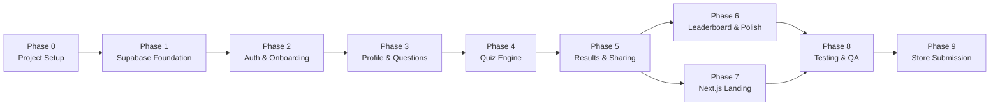
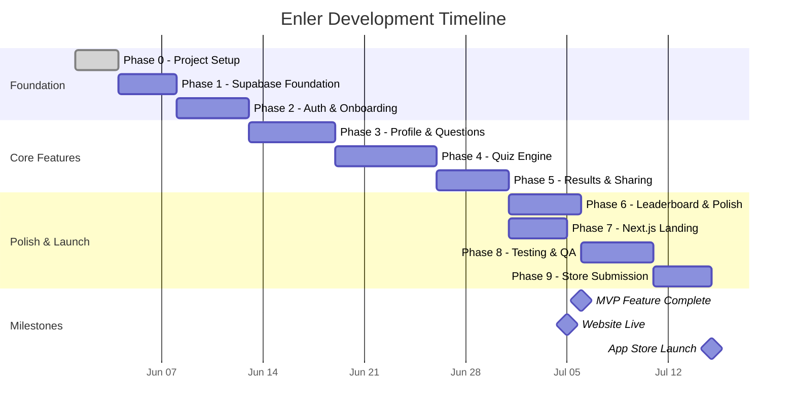

# Roadmap

> Enler — Development Roadmap & Timeline

---

## Overview

Enler development is organized into **10 phases** (0–9), progressing from project setup through MVP launch and post-launch iteration. Each phase builds on the previous one, and phases are designed to produce a testable deliverable.

**Target:** MVP launch in ~12 weeks from project kickoff.

---

## Phase Summary

| Phase | Name                    | Duration  | Status      |
|-------|------------------------|-----------|-------------|
| 0     | Project Setup          | 3 days    | ✅ Complete  |
| 1     | Supabase Foundation    | 4 days    | 🔲 Pending  |
| 2     | Auth & Onboarding      | 5 days    | 🔲 Pending  |
| 3     | Profile & Questions    | 6 days    | 🔲 Pending  |
| 4     | Quiz Engine            | 7 days    | 🔲 Pending  |
| 5     | Results & Sharing      | 5 days    | 🔲 Pending  |
| 6     | Leaderboard & Polish   | 5 days    | 🔲 Pending  |
| 7     | Next.js Landing        | 4 days    | 🔲 Pending  |
| 8     | Testing & QA           | 5 days    | 🔲 Pending  |
| 9     | Store Submission       | 4 days    | 🔲 Pending  |

**Total estimated duration:** ~48 days (~10 weeks)

---

## Phase Details

### Phase 0 — Project Setup (3 days)

Foundation documents, rules, and repository configuration.

| Task | Description | Est. |
|------|-------------|------|
| 0.1  | Create project repository and .gitignore | 0.5d |
| 0.2  | Write PROJECT_STATUS.md | 0.5d |
| 0.3  | Set up AI rules (.gemini/rules.md, .cursor/rules/) | 0.5d |
| 0.4  | Write architecture documentation (ARCHITECTURE.md) | 0.5d |
| 0.5  | Define design system (DESIGN_SYSTEM.md) | 0.25d |
| 0.6  | Design database schema (DATABASE_SCHEMA.md) | 0.5d |
| 0.7  | Write API spec, roadmap, and remaining docs | 0.25d |

**Deliverable:** Complete documentation foundation, all AI assistants can understand the project.

**Dependencies:** None

---

### Phase 1 — Supabase Foundation (4 days)

Database, RLS, storage, and Edge Function scaffolding.

| Task | Description | Est. |
|------|-------------|------|
| 1.1  | Initialize Supabase project | 0.5d |
| 1.2  | Create SQL migration: `profiles` table + RLS | 0.5d |
| 1.3  | Create SQL migration: `questions` table + RLS | 0.5d |
| 1.4  | Create SQL migration: `quiz_sessions` + `quiz_answers` tables + RLS | 0.5d |
| 1.5  | Create SQL migration: `scores` table + RLS | 0.5d |
| 1.6  | Create `handle_new_user` trigger function | 0.25d |
| 1.7  | Set up storage buckets (avatars, og-images) | 0.25d |
| 1.8  | Scaffold Edge Functions directory structure | 0.25d |
| 1.9  | Write RLS policy tests | 0.25d |
| 1.10 | Validate all migrations with `supabase db reset` | 0.5d |

**Deliverable:** Fully configured Supabase project with all tables, RLS, and storage.

**Dependencies:** Phase 0

---

### Phase 2 — Auth & Onboarding (5 days)

Flutter app initialization, authentication, and user onboarding flow.

| Task | Description | Est. |
|------|-------------|------|
| 2.1  | Initialize Flutter project with feature-first structure | 0.5d |
| 2.2  | Configure Supabase Flutter SDK | 0.25d |
| 2.3  | Set up Riverpod and GoRouter | 0.5d |
| 2.4  | Set up i18n with `slang` (Turkish strings) | 0.5d |
| 2.5  | Implement Soft Aurora theme (ThemeData) | 0.5d |
| 2.6  | Build splash screen | 0.25d |
| 2.7  | Build onboarding carousel (3 pages) | 0.75d |
| 2.8  | Build sign-in screen (Magic Link + Social) | 0.75d |
| 2.9  | Build username selection screen | 0.5d |
| 2.10 | Implement auth state management (Riverpod) | 0.5d |

**Deliverable:** Working app with authentication and onboarding flow.

**Dependencies:** Phase 1

---

### Phase 3 — Profile & Questions (6 days)

Profile editing, question creation, and the core content flow.

| Task | Description | Est. |
|------|-------------|------|
| 3.1  | Build profile screen (view mode) | 0.75d |
| 3.2  | Build profile edit screen | 0.75d |
| 3.3  | Implement avatar upload with cropping | 0.5d |
| 3.4  | Build question categories list screen | 0.5d |
| 3.5  | Build question editor screen | 0.75d |
| 3.6  | Implement question CRUD operations | 0.5d |
| 3.7  | Build profile completeness indicator | 0.5d |
| 3.8  | Build share profile link feature | 0.5d |
| 3.9  | Add empty states and loading states | 0.5d |
| 3.10 | Profile screen widget tests | 0.75d |

**Deliverable:** Users can create profiles, add questions, and share their profile link.

**Dependencies:** Phase 2

---

### Phase 4 — Quiz Engine (7 days)

The core quiz gameplay loop: generating options, playing, and submitting.

| Task | Description | Est. |
|------|-------------|------|
| 4.1  | Implement `generate-wrong-answers` Edge Function | 1d |
| 4.2  | Implement Gemini API integration in Edge Function | 0.5d |
| 4.3  | Build quiz start screen (with profile preview) | 0.5d |
| 4.4  | Build quiz question screen with answer options | 1d |
| 4.5  | Implement answer selection + correct/wrong animation | 0.75d |
| 4.6  | Build quiz progress indicator | 0.25d |
| 4.7  | Implement session management (create, answer, complete) | 0.75d |
| 4.8  | Implement `calculate-score` Edge Function | 0.75d |
| 4.9  | Handle edge cases (no questions, already played, network error) | 0.75d |
| 4.10 | Quiz flow integration tests | 0.75d |

**Deliverable:** Complete quiz gameplay from start to score.

**Dependencies:** Phase 3, Phase 1 (Edge Functions)

---

### Phase 5 — Results & Sharing (5 days)

Score results screen, badge display, and social sharing.

| Task | Description | Est. |
|------|-------------|------|
| 5.1  | Build results screen with score + badge | 0.75d |
| 5.2  | Implement badge tier display with animations | 0.5d |
| 5.3  | Implement `generate-og-image` Edge Function | 1d |
| 5.4  | Build share card UI (gradient card preview) | 0.5d |
| 5.5  | Implement native share sheet integration | 0.5d |
| 5.6  | Build deep link handling (open quiz from shared link) | 0.75d |
| 5.7  | Implement "Play Again" and "Challenge Back" flows | 0.5d |
| 5.8  | Results screen widget tests | 0.5d |

**Deliverable:** Players can see results, earn badges, and share to social media.

**Dependencies:** Phase 4

---

### Phase 6 — Leaderboard & Polish (5 days)

Leaderboard, realtime updates, and UI polish pass.

| Task | Description | Est. |
|------|-------------|------|
| 6.1  | Build leaderboard screen | 0.75d |
| 6.2  | Implement Realtime subscription for live scores | 0.5d |
| 6.3  | Build notification system (in-app) | 0.75d |
| 6.4  | UI polish pass: animations, transitions | 0.75d |
| 6.5  | Accessibility audit (semantics, contrast) | 0.5d |
| 6.6  | Performance optimization (lazy loading, caching) | 0.5d |
| 6.7  | Error state polish (empty, error, offline) | 0.5d |
| 6.8  | Haptic feedback and sound effects | 0.25d |
| 6.9  | Dark mode preparation (defer implementation) | 0.5d |

**Deliverable:** Polished app with leaderboard and realtime features.

**Dependencies:** Phase 5

---

### Phase 7 — Next.js Landing (4 days)

Public website: landing page, shared quiz results, and privacy/terms.

| Task | Description | Est. |
|------|-------------|------|
| 7.1  | Initialize Next.js project with App Router | 0.25d |
| 7.2  | Build landing page (hero, features, download links) | 1d |
| 7.3  | Build shared result page (`/u/{username}/result/{id}`) | 0.75d |
| 7.4  | Implement OG meta tags for social preview | 0.5d |
| 7.5  | Build privacy policy page | 0.25d |
| 7.6  | Build terms of service page | 0.25d |
| 7.7  | Deploy to Vercel | 0.25d |
| 7.8  | Configure custom domain (enlerapp.com) | 0.25d |
| 7.9  | Lighthouse performance optimization | 0.5d |

**Deliverable:** Live website at enlerapp.com with all required legal pages.

**Dependencies:** Phase 5 (for share page data), can run in parallel with Phase 6

---

### Phase 8 — Testing & QA (5 days)

Comprehensive testing, bug fixing, and quality assurance.

| Task | Description | Est. |
|------|-------------|------|
| 8.1  | Unit test coverage pass (target: 90% business logic) | 1d |
| 8.2  | Widget test coverage pass (all feature screens) | 1d |
| 8.3  | Integration test: full onboarding flow | 0.5d |
| 8.4  | Integration test: full quiz flow | 0.5d |
| 8.5  | Integration test: share + deep link flow | 0.5d |
| 8.6  | Set up GitHub Actions CI pipeline | 0.5d |
| 8.7  | Bug fix sprint | 0.5d |
| 8.8  | Beta testing with 5–10 real users | 0.5d |

**Deliverable:** Stable, tested application ready for store submission.

**Dependencies:** Phase 6, Phase 7

---

### Phase 9 — Store Submission (4 days)

App store preparation, screenshots, and submission.

| Task | Description | Est. |
|------|-------------|------|
| 9.1  | Generate app icon (1024×1024) | 0.25d |
| 9.2  | Create App Store screenshots (6.7", 6.5", 5.5") | 0.75d |
| 9.3  | Create Google Play screenshots and feature graphic | 0.75d |
| 9.4  | Write store descriptions (Turkish + English) | 0.5d |
| 9.5  | Configure iOS build (certificates, provisioning) | 0.5d |
| 9.6  | Configure Android build (signing key, bundle) | 0.25d |
| 9.7  | Submit to Apple App Store | 0.25d |
| 9.8  | Submit to Google Play Store | 0.25d |
| 9.9  | App review response and fixes | 0.5d |

**Deliverable:** App live on both stores. 🎉

**Dependencies:** Phase 8

---

## Phase Dependencies

---

## Timeline (Gantt Chart)

---

## Post-MVP Roadmap

### v1.1 — Engagement Update (~4 weeks after launch)

Focus: Increase retention and daily usage.

| Feature | Description | Priority |
|---------|-------------|----------|
| 🎯 Düello Mode | Two players answer each other's questions simultaneously, compare scores | High |
| 📦 Seasonal Question Packs | Themed question sets (e.g., "Yaz Soruları", "Yılbaşı Özel") | Medium |
| 🔔 Advanced Notifications | Push notifications for new quiz completions, challenges, weekly digests | High |
| 📊 Session History | View past quiz sessions with details | Medium |
| 🎨 Profile Themes | Let users customize their profile card colors | Low |

### v1.2 — Intelligence Update (~8 weeks after launch)

Focus: Smarter AI and analytics.

| Feature | Description | Priority |
|---------|-------------|----------|
| 📈 Profile Analytics | How well friends know you (avg score), most-missed questions | High |
| 🤖 AI Question Suggestions | Gemini suggests personalized questions based on category | High |
| 🔄 Improved Distractors | Better wrong answer generation using context from all user answers | Medium |
| 🏆 Weekly Leaderboard Reset | Time-boxed competitions with rewards | Medium |
| 🌍 English Language Support | Full i18n for international expansion | Medium |

### v2.0 — Social Update (~16 weeks after launch)

Focus: Transform from tool to social platform.

| Feature | Description | Priority |
|---------|-------------|----------|
| 👥 Friends System | Add friends, see friend list, friend-only quizzes | High |
| 📱 Mini Feed | See friends' recent quiz results and achievements | High |
| 🎮 Group Challenges | Create a group, everyone answers about each member | High |
| 💬 Comments | Comment on quiz results | Medium |
| 🏅 Achievement System | Unlock badges for milestones (10 quizzes, all perfect scores, etc.) | Medium |
| 📤 Story Integration | Share directly to Instagram/TikTok Stories | Medium |
| 🌙 Dark Mode | Full dark theme support | Low |

### v2.1+ — Growth & Monetization (Future)

| Feature | Description |
|---------|-------------|
| 💎 Premium Subscription | Unlimited questions, exclusive themes, analytics |
| 🏢 Brand Partnerships | Sponsored question packs |
| 🌐 Multi-language | Arabic, Spanish, Portuguese, German |
| 🎥 Video Questions | Record short video answers |
| 🤝 Couple Mode | Special quiz mode for romantic partners |
| 📺 Live Quiz Events | Real-time multiplayer quiz events |

---

## Success Metrics

### Launch Targets (First 30 Days)

| Metric | Target |
|--------|--------|
| Downloads | 1,000+ |
| DAU | 200+ |
| Quizzes Completed | 5,000+ |
| Avg Session Length | 3+ minutes |
| App Store Rating | 4.5+ stars |
| Crash-free Rate | 99.5%+ |

### Growth Targets (First 90 Days)

| Metric | Target |
|--------|--------|
| Downloads | 10,000+ |
| MAU | 3,000+ |
| Viral Coefficient (K) | > 1.2 |
| Share Rate | 40%+ of completed quizzes |
| Retention (D7) | 30%+ |
| Retention (D30) | 15%+ |
